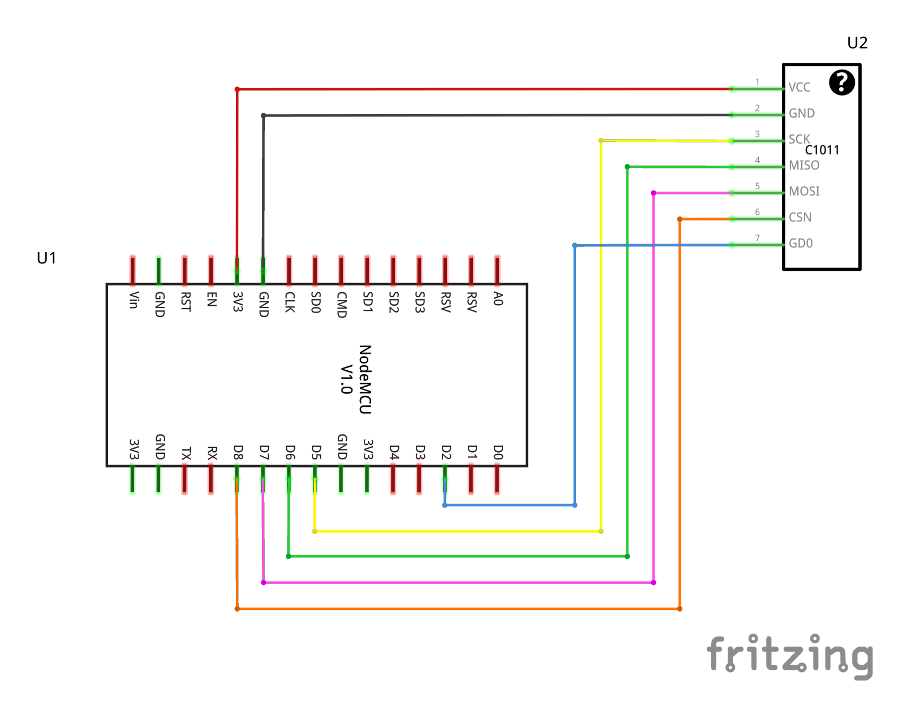

# RF Setup #

## Wiring 

* Wire up the C1011 receiver like this



## Install node-red nodes for on-off-keying

* Install npm ```e.g apt install npm```
* Go to node-red/on-off-keying and run: "npm install" and "npm run build"
* Go to docker/node-red-data
* Run npm install "../../node-red/on-off-keying"
* Restart docker containers if needed

